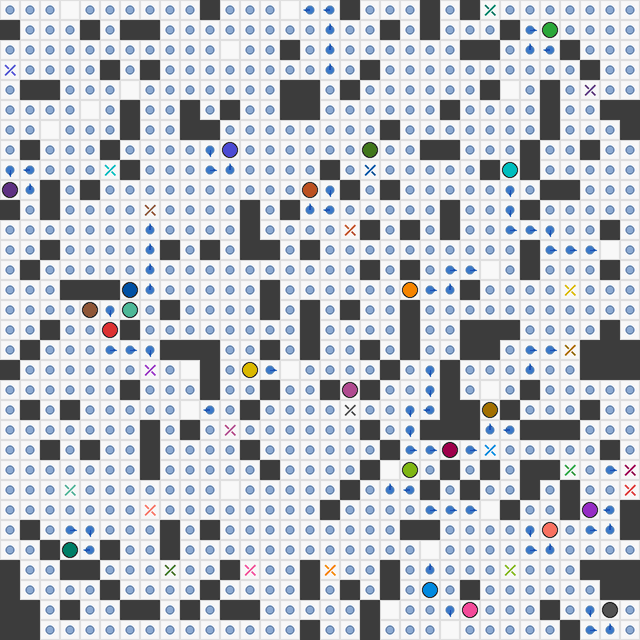

# 编译与运行

[English](README.md)



需要 Linux、支持 C++17 的编译器、Make 和 Boost.Program_options 开发文件
（含静态库）。以下命令均在本目录运行。

Ubuntu/Debian 安装依赖并编译：

```bash
sudo apt-get install build-essential libboost-program-options-dev
make
```

运行随附示例：

```bash
./focbs -i tools/example.mapfua --conflict-selection random -t 60
```

生成其他输入需要 Python 3，仅使用标准库：

```bash
python3 tools/gen_mapfua.py --map tools/random-32-32-20.map \
  --num-assigned 22 --num-unassigned 756 --seed 0 --output tools/generated.mapfua
./focbs -i tools/generated.mapfua --conflict-selection random -t 60
```

可按需修改数量和随机种子。使用其他输入时，将 `tools/example.mapfua`
替换为相应文件路径。

输入文件内的相对地图路径以该输入文件所在目录为基准。
也可以使用地图和场景文件；将 `10` 替换为需要读取的数量：

```bash
./focbs --map /path/to/map.map --agents /path/to/tasks.scen --agentNum 10 -t 60
```

`-t` 指定时间限制，单位为秒。查看全部命令行参数：

```bash
./focbs --help
```
